# Design Document

## Overview

This document describes the technical design for implementing a comprehensive RAG system based on RAGFlow architecture. The system will be built using FastAPI with trio async backend, PostgreSQL for metadata, Infinity DB for vector storage, Redis for caching, and integration with Yandex Cloud ML services.

The architecture follows a microservices-oriented approach within a monolithic FastAPI application, with clear separation of concerns and modular design for maintainability and scalability. Key differentiators include trio-based async processing, specialized document parsers, custom Russian/English tokenization, and external search integration.

## Architecture

### High-Level Architecture

```mermaid
graph TB
    Client[Client Applications] --> Nginx[Nginx Load Balancer]
    Nginx --> API[FastAPI Backend]
    
    API --> Auth[Authentication Service]
    API --> DocProc[Document Processing Service]
    API --> Search[Search Service]
    API --> KG[Knowledge Graph Service]
    
    DocProc --> DeepDoc[DeepDoc Engine]
    DocProc --> Chunking[Chunking Engine]
    DocProc --> Enrichment[Content Enrichment]
    
    Search --> Hybrid[Hybrid Retriever]
    Search --> Rerank[Reranking Service]
    Search --> Response[Response Generator]
    
    DeepDoc --> ONNX[ONNX Models]
    Enrichment --> YandexLLM[Yandex LLM]
    Response --> YandexLLM
    KG --> YandexLLM
    
    API --> PostgreSQL[(PostgreSQL)]
    API --> Elasticsearch[(Elasticsearch)]
    API --> Infinity[(Infinity DB)]
    API --> Redis[(Redis Cache)]
    API --> MinIO[MinIO File Storage]
    
    subgraph "External Services"
        YandexLLM[Yandex Cloud ML]
    end
    
    subgraph "ONNX Models"
        LayoutModel[Layout Recognition]
        OCRModel[OCR Models]
        TableModel[Table Recognition]
    end
```



### Service Layer Architecture


## Components and Interfaces

### 1. Document Processing Components

#### DeepDoc Engine
```python
class DeepDocEngine:
    """Deep Document Understanding engine with CV models"""
    
    def __init__(self, models_path: str, confidence_threshold: float = 0.7):
        self.layout_recognizer = LayoutRecognizer(models_path)
        self.ocr_engine = OCREngine(models_path)
        self.table_recognizer = TableRecognizer(models_path)
        
    async def process_pdf(self, pdf_bytes: bytes) -> DocumentStructure:
        """Process PDF with full DeepDoc pipeline"""
        
    async def extract_layout(self, page_image: np.ndarray) -> List[LayoutBlock]:
        """Extract layout blocks from page image"""
        
    async def perform_ocr(self, image: np.ndarray, blocks: List[LayoutBlock]) -> List[TextBlock]:
        """Perform OCR on detected text regions"""
        
    async def recognize_tables(self, image: np.ndarray, table_blocks: List[LayoutBlock]) -> List[Table]:
        """Recognize table structure and convert to HTML/Markdown"""
```

#### Chunking Engine
```python
class ChunkingEngine:
    """Advanced chunking with multiple strategies"""
    
    def __init__(self, default_strategy: str = "hierarchical"):
        self.strategies = {
            "naive": NaiveMergeStrategy(),
            "hierarchical": HierarchicalMergeStrategy(),
            "qa": QAChunkingStrategy(),
            "table": TableChunkingStrategy()
        }
        self.raptor = RAPTORProcessor()
        
    async def chunk_document(self, document: DocumentStructure, strategy: str = None) -> List[Chunk]:
        """Chunk document using specified or auto-selected strategy"""
        
    async def apply_raptor(self, chunks: List[Chunk]) -> List[Chunk]:
        """Apply RAPTOR hierarchical clustering and summarization"""
```

#### Content Enrichment Engine
```python
class ContentEnrichmentEngine:
    """LLM-based content enrichment"""
    
    def __init__(self, llm_client: YandexLLMWrapper):
        self.llm_client = llm_client
        self.keyword_extractor = KeywordExtractor(llm_client)
        self.question_generator = QuestionGenerator(llm_client)
        self.content_tagger = ContentTagger(llm_client)
        
    async def enrich_chunk(self, chunk: Chunk) -> ChunkEnrichment:
        """Extract keywords, generate questions, and assign tags"""
        
    async def batch_enrich(self, chunks: List[Chunk]) -> List[ChunkEnrichment]:
        """Batch process multiple chunks for efficiency"""
```

### 2. Search Components

#### Hybrid Retriever
```python
class HybridRetriever:
    """Hybrid sparse + dense retrieval with fusion"""
    
    def __init__(self, infinity_client: InfinityClient, sparse_weight: float = 0.3, dense_weight: float = 0.7):
        self.infinity_client = infinity_client
        self.sparse_retriever = SparseRetriever()
        self.dense_retriever = DenseRetriever(infinity_client)
        self.fusion_engine = FusionEngine(sparse_weight, dense_weight)
        
    async def retrieve(self, query: str, document_ids: List[str] = None, top_k: int = 20) -> List[SearchResult]:
        """Perform hybrid retrieval with result fusion"""
        
    async def sparse_search(self, query: str, filters: Dict) -> List[SearchResult]:
        """Full-text search with term weighting and synonyms"""
        
    async def dense_search(self, query_embedding: List[float], filters: Dict) -> List[SearchResult]:
        """Vector similarity search"""
```

#### Reranking Service
```python
class RerankingService:
    """Advanced reranking with multiple strategies"""
    
    def __init__(self, llm_client: YandexLLMWrapper):
        self.llm_client = llm_client
        self.cross_encoder = None  # Optional: specialized reranking model
        
    async def rerank_results(self, query: str, results: List[SearchResult], top_k: int = 5) -> List[SearchResult]:
        """Rerank search results using LLM-based scoring"""
        
    async def llm_rerank(self, query: str, results: List[SearchResult]) -> List[float]:
        """Use LLM to score result relevance"""
```

#### Response Generator
```python
class ResponseGenerator:
    """Agentic response generation with citations"""
    
    def __init__(self, llm_client: YandexLLMWrapper, kg_service: KnowledgeGraphService):
        self.llm_client = llm_client
        self.kg_service = kg_service
        self.citation_generator = CitationGenerator()
        self.agentic_processor = AgenticProcessor(llm_client)
        
    async def generate_response(self, query: str, context: List[SearchResult], 
                              history: List[ChatMessage] = None, agentic_mode: bool = False) -> ChatResponse:
        """Generate response with citations and reasoning"""
        
    async def agentic_search(self, query: str, max_iterations: int = 3) -> AgenticResponse:
        """Multi-step agentic reasoning and search"""
```

### 3. Knowledge Graph Components

#### Entity and Relation Extractor
```python
class EntityRelationExtractor:
    """Extract entities and relations using LLM"""
    
    def __init__(self, llm_client: YandexLLMWrapper, spacy_model: str = "ru_core_news_md"):
        self.llm_client = llm_client
        self.nlp = spacy.load(spacy_model)
        
    async def extract_entities(self, text: str) -> List[Entity]:
        """Extract named entities with confidence scores"""
        
    async def extract_relations(self, text: str, entities: List[Entity]) -> List[Relation]:
        """Extract relationships between entities"""
```

#### Graph Builder
```python
class GraphBuilder:
    """Build and maintain knowledge graph"""
    
    def __init__(self, kuzu_connection: kuzu.Connection):
        self.conn = kuzu_connection
        self.community_detector = CommunityDetector()
        
    async def build_graph(self, entities: List[Entity], relations: List[Relation]) -> nx.Graph:
        """Build NetworkX graph from entities and relations"""
        
    async def detect_communities(self, graph: nx.Graph) -> List[Community]:
        """Detect communities using Leiden algorithm"""
        
    async def generate_community_reports(self, communities: List[Community]) -> List[CommunityReport]:
        """Generate LLM-based community summaries"""
```

### 4. Advanced Document Parsers

#### RAGFlow Document Parsers
```python
class RAGFlowDocxParser:
    """Advanced DOCX parser with table extraction and structure preservation"""
    
    def __init__(self):
        self.doc = None
        
    def __extract_table_content(self, table) -> pd.DataFrame:
        """Extract table content with proper structure"""
        
    def __compose_table_content(self, df: pd.DataFrame) -> str:
        """Compose table content with headers and data type detection"""
        
    async def __call__(self, filename: str, binary: bytes = None) -> List[Tuple[str, str]]:
        """Parse DOCX with advanced table and structure handling"""

class RAGFlowExcelParser:
    """Advanced Excel parser with HTML conversion and data typing"""
    
    @staticmethod
    def _load_excel_to_workbook(file_like_object):
        """Load Excel file with format detection"""
        
    def html(self, filename: str, chunk_rows: int = 256) -> List[str]:
        """Convert Excel to HTML chunks with proper formatting"""
        
    async def __call__(self, filename: str) -> List[str]:
        """Parse Excel with data type detection and structure preservation"""

class RAGFlowPptParser:
    """Advanced PowerPoint parser with slide structure extraction"""
    
    def __get_bulleted_text(self, paragraph) -> bool:
        """Detect bulleted text in presentations"""
        
    def __extract(self, shape) -> str:
        """Extract text and tables from shapes"""
        
    async def __call__(self, filename: str, from_page: int = 0, to_page: int = 100000) -> List[str]:
        """Parse PowerPoint with slide structure preservation"""

class RAGFlowJsonParser:
    """Intelligent JSON parser with large file splitting"""
    
    @staticmethod
    def _json_size(data: dict) -> int:
        """Calculate JSON object size"""
        
    def _json_split(self, data: Any, current_path: List[str], chunks: List[dict]) -> List[dict]:
        """Split large JSON files intelligently"""
        
    async def __call__(self, binary: bytes) -> List[str]:
        """Parse JSON with intelligent chunking for large files"""

class RAGFlowMarkdownParser:
    """Advanced Markdown parser with table detection"""
    
    def extract_tables_and_remainder(self, markdown_text: str) -> Tuple[List[str], str]:
        """Extract tables from Markdown while preserving structure"""
        
    async def __call__(self, text: str) -> List[str]:
        """Parse Markdown with table structure preservation"""

class RAGFlowHtmlParser:
    """HTML parser with content cleaning using readability"""
    
    @classmethod
    def parser_txt(cls, txt: str) -> List[str]:
        """Parse HTML with readability-lxml for content extraction"""
        
    async def __call__(self, filename: str, binary: bytes = None) -> List[str]:
        """Parse HTML with content cleaning and structure preservation"""
```

### 5. NLP and Tokenization Components

#### RagTokenizer
```python
class RagTokenizer:
    """Custom tokenizer for Russian and English with frequency analysis"""
    
    def __init__(self, debug: bool = False):
        self.dictionary = {}  # Token frequency dictionary
        self.trie = None      # Trie for fast tokenization
        
    def tokenize(self, text: str) -> str:
        """Main tokenization method with language detection"""
        
    def fine_grained_tokenize(self, tokens: str) -> str:
        """Fine-grained tokenization for better accuracy"""
        
    def freq(self, token: str) -> int:
        """Get token frequency from built-in dictionary"""
        
    def tag(self, token: str) -> str:
        """Get part-of-speech tag for token"""
        
    def _split_by_lang(self, text: str) -> List[Tuple[str, bool]]:
        """Split text by language (Chinese/English detection)"""
        
    def _strQ2B(self, text: str) -> str:
        """Convert full-width to half-width characters"""
        
    def _tradi2simp(self, text: str) -> str:
        """Convert traditional Chinese to simplified"""

class TermWeightCalculator:
    """Calculate term weights using TF-IDF and custom dictionaries"""
    
    def __init__(self):
        self.idf_dict = {}
        self.skill_dict = {}
        self.ner_dict = {}
        
    def weights(self, tokens: List[str], preprocess: bool = True) -> List[Tuple[str, float]]:
        """Calculate TF-IDF weights for tokens"""
        
    def split(self, text: str) -> List[str]:
        """Split text into tokens for weight calculation"""
        
    def pretoken(self, text: str, num: bool = False, stpwd: bool = True) -> List[str]:
        """Preprocess tokens before weight calculation"""

class SynonymExpander:
    """Expand queries with synonyms using WordNet and custom dictionaries"""
    
    def __init__(self, redis_client=None):
        self.dictionary = {}
        self.redis = redis_client
        
    def lookup(self, token: str, topn: int = 8) -> List[str]:
        """Find synonyms for a token using WordNet and custom dictionaries"""
        
    def load(self):
        """Load synonym dictionary from Redis cache"""
```

### 6. External Search Integration

#### Tavily Search Integration
```python
class TavilySearchClient:
    """Integration with Tavily API for external web search"""
    
    def __init__(self, api_key: str):
        self.api_key = api_key
        self.tavily_client = TavilyClient(api_key=api_key)
        
    async def search(self, query: str) -> Dict[str, Any]:
        """Perform web search using Tavily API"""
        
    async def retrieve_chunks(self, question: str) -> Dict[str, Any]:
        """Retrieve and format search results as chunks"""

class AgenticProcessor:
    """Multi-step agentic reasoning with external search"""
    
    def __init__(self, llm_client: YandexLLMWrapper, tavily_client: TavilySearchClient):
        self.llm_client = llm_client
        self.tavily_client = tavily_client
        self.max_search_limit = 6
        
    async def thinking(self, chunk_info: dict, question: str) -> Dict[str, Any]:
        """Perform multi-step reasoning with iterative searches"""
        
    async def _generate_reasoning(self, msg_history: List[dict]) -> str:
        """Generate reasoning steps using LLM"""
        
    async def _extract_search_queries(self, reasoning: str, question: str, step_index: int) -> List[str]:
        """Extract search queries from reasoning steps"""
        
    async def _retrieve_information(self, search_query: str) -> Dict[str, Any]:
        """Retrieve information from internal KB and external sources"""
```

### 7. Performance Optimization Components

#### Fast Hashing and Caching
```python
class OptimizedCache:
    """High-performance caching with xxhash"""
    
    def __init__(self, redis_client):
        self.redis = redis_client
        
    def get_llm_cache(self, llm_name: str, text: str, history: List[dict], gen_config: dict) -> Optional[str]:
        """Get cached LLM response using xxhash for key generation"""
        hasher = xxhash.xxh64()
        hasher.update(llm_name.encode())
        hasher.update(text.encode())
        hasher.update(json.dumps(history, sort_keys=True).encode())
        hasher.update(json.dumps(gen_config, sort_keys=True).encode())
        cache_key = hasher.hexdigest()
        return self.redis.get(cache_key)
        
    def set_llm_cache(self, llm_name: str, text: str, response: str, history: List[dict], gen_config: dict, ttl: int = 3600):
        """Cache LLM response with optimized key generation"""
        
    def get_embed_cache(self, model_name: str, text: str) -> Optional[List[float]]:
        """Get cached embeddings"""
        
    def set_embed_cache(self, model_name: str, text: str, embeddings: List[float]):
        """Cache embeddings with compression"""

class GeometricProcessor:
    """Geometric operations for PDF processing using pyclipper"""
    
    @staticmethod
    def unclip_polygon(box: List[float], unclip_ratio: float) -> np.ndarray:
        """Expand polygon using pyclipper for better text detection"""
        from shapely.geometry import Polygon
        import pyclipper
        
        poly = Polygon(box)
        distance = poly.area * unclip_ratio / poly.length
        offset = pyclipper.PyclipperOffset()
        offset.AddPath(box, pyclipper.JT_ROUND, pyclipper.ET_CLOSEDPOLYGON)
        expanded = np.array(offset.Execute(distance))
        return expanded

class StringProcessor:
    """Optimized string processing utilities"""
    
    @staticmethod
    def calculate_edit_distance(str1: str, str2: str) -> int:
        """Calculate edit distance using optimized algorithm"""
        import editdistance
        return editdistance.eval(str1, str2)
        
    @staticmethod
    def repair_json(malformed_json: str) -> str:
        """Repair malformed JSON using json-repair"""
        import json_repair
        return json_repair.repair_json(malformed_json)
        
    @staticmethod
    def words_to_numbers(text: str) -> str:
        """Convert word numbers to digits"""
        from word2number import w2n
        # Implementation for converting words to numbers
        return text
```

### 8. RAPTOR Hierarchical Clustering

#### RAPTOR Processor
```python
class RAPTORProcessor:
    """Recursive Abstractive Processing for Tree-Organized Retrieval"""
    
    def __init__(self, llm_client: YandexLLMWrapper):
        self.llm_client = llm_client
        
    def _get_optimal_clusters(self, embeddings: np.ndarray, random_state: int = 42) -> int:
        """Use BIC to determine optimal number of clusters"""
        max_clusters = min(len(embeddings), 20)
        n_clusters_range = range(2, max_clusters + 1)
        bics = []
        
        for n in n_clusters_range:
            gm = GaussianMixture(n_components=n, random_state=random_state)
            gm.fit(embeddings)
            bics.append(gm.bic(embeddings))
            
        optimal_clusters = n_clusters_range[np.argmin(bics)]
        return optimal_clusters
        
    async def cluster_embeddings(self, embeddings: List[List[float]], random_state: int = 42) -> List[int]:
        """Cluster embeddings using UMAP + GaussianMixture"""
        embeddings_array = np.array(embeddings)
        
        # Dimensionality reduction with UMAP
        n_neighbors = int((len(embeddings) - 1) ** 0.8)
        reduced_embeddings = umap.UMAP(
            n_neighbors=n_neighbors,
            n_components=10,
            min_dist=0.0,
            metric="cosine"
        ).fit_transform(embeddings_array)
        
        # Optimal clustering with GaussianMixture
        n_clusters = self._get_optimal_clusters(reduced_embeddings, random_state)
        
        if n_clusters == 1:
            return [0] * len(reduced_embeddings)
            
        gm = GaussianMixture(n_components=n_clusters, random_state=random_state)
        gm.fit(reduced_embeddings)
        labels = gm.predict(reduced_embeddings)
        
        return labels.tolist()
        
    async def generate_cluster_summary(self, cluster_chunks: List[str]) -> str:
        """Generate summary for a cluster of chunks using LLM"""
        combined_text = "\n\n".join(cluster_chunks)
        
        prompt = f"""
        Создайте краткую сводку следующих связанных фрагментов текста.
        Сводка должна отражать основные темы и ключевые идеи:
        
        {combined_text}
        
        Сводка:
        """
        
        summary = await self.llm_client.generate(prompt)
        return summary
        
    async def build_hierarchy(self, chunks: List[Chunk], max_levels: int = 3) -> List[Chunk]:
        """Build hierarchical structure of chunks with summaries"""
        current_level_chunks = chunks
        all_chunks = chunks.copy()
        
        for level in range(1, max_levels + 1):
            if len(current_level_chunks) <= 2:
                break
                
            # Get embeddings for current level
            embeddings = [chunk.embedding for chunk in current_level_chunks]
            
            # Cluster chunks
            labels = await self.cluster_embeddings(embeddings)
            
            # Group chunks by cluster
            clusters = {}
            for chunk, label in zip(current_level_chunks, labels):
                if label not in clusters:
                    clusters[label] = []
                clusters[label].append(chunk)
            
            # Generate summaries for each cluster
            next_level_chunks = []
            for cluster_id, cluster_chunks in clusters.items():
                if len(cluster_chunks) == 1:
                    next_level_chunks.extend(cluster_chunks)
                    continue
                    
                # Generate summary
                chunk_texts = [chunk.content for chunk in cluster_chunks]
                summary = await self.generate_cluster_summary(chunk_texts)
                
                # Create summary chunk
                summary_chunk = Chunk(
                    id=uuid.uuid4(),
                    content=summary,
                    chunk_type=ChunkType.SUMMARY,
                    chunk_strategy="raptor",
                    document_id=cluster_chunks[0].document_id,
                    raptor_level=level,
                    parent_chunk_id=None,
                    token_count=len(summary.split())
                )
                
                # Set parent relationships
                for chunk in cluster_chunks:
                    chunk.parent_chunk_id = summary_chunk.id
                
                next_level_chunks.append(summary_chunk)
                all_chunks.append(summary_chunk)
            
            current_level_chunks = next_level_chunks
            
        return all_chunks

class HierarchicalMerger:
    """Advanced hierarchical text merging based on document structure"""
    
    def __init__(self):
        self.bullet_patterns = [
            r'^\s*[\d]+\.', r'^\s*[a-zA-Z]\.', r'^\s*[ivxlcdm]+\.', 
            r'^\s*•', r'^\s*-', r'^\s*\*'
        ]
        
    def bullets_category(self, sections: List[str]) -> List[int]:
        """Categorize sections by bullet/numbering level"""
        levels = []
        
        for section in sections:
            level = 0
            for i, pattern in enumerate(self.bullet_patterns):
                if re.match(pattern, section, re.IGNORECASE):
                    level = i + 1
                    break
            levels.append(level)
            
        return levels
        
    def hierarchical_merge(self, bullet_levels: List[int], sections: List[str], depth: int = 5) -> List[str]:
        """Merge sections hierarchically based on bullet levels"""
        if not sections:
            return []
            
        merged = []
        current_group = []
        current_level = bullet_levels[0] if bullet_levels else 0
        
        for i, (section, level) in enumerate(zip(sections, bullet_levels)):
            if level <= current_level and current_group:
                # Start new group
                merged.append('\n'.join(current_group))
                current_group = [section]
                current_level = level
            else:
                current_group.append(section)
                
        if current_group:
            merged.append('\n'.join(current_group))
            
        return merged

class MultiLanguageProcessor:
    """Multi-language text processing utilities"""
    
    def __init__(self):
        self.chinese_converter = None
        self.pinyin_converter = None
        
    def traditional_to_simplified(self, text: str) -> str:
        """Convert traditional Chinese to simplified"""
        try:
            import hanziconv
            return hanziconv.HanziConv.toSimplified(text)
        except ImportError:
            return text
            
    def chinese_numbers_to_arabic(self, text: str) -> str:
        """Convert Chinese numbers to Arabic numerals"""
        try:
            import cn2an
            return cn2an.transform(text, "cn2an")
        except ImportError:
            return text
            
    def text_to_pinyin(self, text: str) -> str:
        """Convert Chinese text to pinyin"""
        try:
            from xpinyin import Pinyin
            p = Pinyin()
            return p.get_pinyin(text, ' ')
        except ImportError:
            return text
            
    def roman_to_arabic(self, text: str) -> str:
        """Convert Roman numerals to Arabic"""
        try:
            from roman_numbers import roman_to_int
            # Find and replace Roman numerals in text
            import re
            roman_pattern = r'\b[IVXLCDM]+\b'
            
            def replace_roman(match):
                try:
                    return str(roman_to_int(match.group()))
                except:
                    return match.group()
                    
            return re.sub(roman_pattern, replace_roman, text)
        except ImportError:
            return text
            
    def words_to_numbers(self, text: str) -> str:
        """Convert word numbers to digits"""
        try:
            from word2number import w2n
            words = text.split()
            result = []
            
            for word in words:
                try:
                    number = w2n.word_to_num(word)
                    result.append(str(number))
                except:
                    result.append(word)
                    
            return ' '.join(result)
        except ImportError:
            return text

class ExtendedLLMIntegrations:
    """Extended LLM provider integrations"""
    
    def __init__(self):
        self.providers = {}
        
    def setup_chinese_providers(self):
        """Setup Chinese LLM providers"""
        # Qwen through DashScope
        try:
            import dashscope
            self.providers['qwen'] = dashscope
        except ImportError:
            pass
            
        # ChatGLM through ZhipuAI
        try:
            import zhipuai
            self.providers['chatglm'] = zhipuai
        except ImportError:
            pass
            
        # ByteDance through VolcEngine
        try:
            import volcengine
            self.providers['bytedance'] = volcengine
        except ImportError:
            pass
            
    def setup_embedding_providers(self):
        """Setup specialized embedding providers"""
        # Voyage AI
        try:
            import voyageai
            self.providers['voyage'] = voyageai
        except ImportError:
            pass
            
        # Chinese embeddings
        try:
            import bcembedding
            self.providers['bcembedding'] = bcembedding
        except ImportError:
            pass
            
        # BGE embeddings
        try:
            from flagembedding import FlagModel
            self.providers['bge'] = FlagModel
        except ImportError:
            pass
            
        # FastEmbed
        try:
            from fastembed import TextEmbedding
            self.providers['fastembed'] = TextEmbedding
        except ImportError:
            pass
            
    async def get_embedding(self, text: str, provider: str = 'default') -> List[float]:
        """Get embeddings from specified provider"""
        if provider in self.providers:
            # Implementation for each provider
            pass
        return []
```

## Data Models

### PostgreSQL Schema

```sql
-- Core document table
CREATE TABLE documents (
    id UUID PRIMARY KEY DEFAULT gen_random_uuid(),
    file_name VARCHAR(255) NOT NULL,
    content_type VARCHAR(100),
    file_size_bytes BIGINT,
    status VARCHAR(20) CHECK (status IN ('PENDING', 'PROCESSING', 'COMPLETED', 'FAILED')) DEFAULT 'PENDING',
    
    -- Processing configuration
    processing_strategy VARCHAR(50) DEFAULT 'hierarchical',
    deepdoc_enabled BOOLEAN DEFAULT true,
    raptor_enabled BOOLEAN DEFAULT false,
    kg_extraction_enabled BOOLEAN DEFAULT true,
    
    -- Processing results
    content_length INTEGER,
    chunk_count INTEGER DEFAULT 0,
    entities_count INTEGER DEFAULT 0,
    relations_count INTEGER DEFAULT 0,
    processing_time_seconds FLOAT,
    
    -- Error handling
    error_message TEXT,
    error_details JSONB,
    
    -- Timestamps
    created_at TIMESTAMP WITH TIME ZONE DEFAULT NOW(),
    updated_at TIMESTAMP WITH TIME ZONE DEFAULT NOW(),
    processed_at TIMESTAMP WITH TIME ZONE
);

-- Document chunks
CREATE TABLE chunks (
    id UUID PRIMARY KEY DEFAULT gen_random_uuid(),
    document_id UUID NOT NULL REFERENCES documents(id) ON DELETE CASCADE,
    
    -- Content
    content TEXT NOT NULL,
    content_hash VARCHAR(64), -- SHA-256 for deduplication
    token_count INTEGER,
    
    -- Chunk metadata
    chunk_type VARCHAR(20) CHECK (chunk_type IN ('text', 'table', 'image', 'summary')) DEFAULT 'text',
    chunk_strategy VARCHAR(50),
    chunk_index INTEGER, -- Order within document
    
    -- Position information
    page_number INTEGER,
    position_info JSONB, -- Coordinates, bounding boxes, etc.
    
    -- RAPTOR hierarchy
    parent_chunk_id UUID REFERENCES chunks(id),
    raptor_level INTEGER DEFAULT 0,
    cluster_id VARCHAR(50),
    
    -- Timestamps
    created_at TIMESTAMP WITH TIME ZONE DEFAULT NOW()
);

-- Chunk enrichments
CREATE TABLE chunk_enrichments (
    id UUID PRIMARY KEY DEFAULT gen_random_uuid(),
    chunk_id UUID NOT NULL REFERENCES chunks(id) ON DELETE CASCADE,
    
    -- Enrichment data
    keywords TEXT[] DEFAULT '{}',
    generated_questions TEXT[] DEFAULT '{}',
    tags TEXT[] DEFAULT '{}',
    
    -- Confidence scores
    keyword_confidence FLOAT,
    question_confidence FLOAT,
    tag_confidence FLOAT,
    
    -- Processing metadata
    enrichment_model VARCHAR(100),
    processing_time_ms INTEGER,
    
    created_at TIMESTAMP WITH TIME ZONE DEFAULT NOW()
);

-- Knowledge graph entities
CREATE TABLE kg_entities (
    id UUID PRIMARY KEY DEFAULT gen_random_uuid(),
    document_id UUID NOT NULL REFERENCES documents(id) ON DELETE CASCADE,
    
    -- Entity data
    entity_name VARCHAR(255) NOT NULL,
    entity_type VARCHAR(50), -- PERSON, ORGANIZATION, LOCATION, etc.
    description TEXT,
    
    -- Confidence and source
    confidence FLOAT,
    source_chunk_ids UUID[] DEFAULT '{}',
    
    -- Normalization
    normalized_name VARCHAR(255), -- For entity resolution
    canonical_id UUID, -- Points to canonical entity after resolution
    
    created_at TIMESTAMP WITH TIME ZONE DEFAULT NOW()
);

-- Knowledge graph relations
CREATE TABLE kg_relations (
    id UUID PRIMARY KEY DEFAULT gen_random_uuid(),
    document_id UUID NOT NULL REFERENCES documents(id) ON DELETE CASCADE,
    
    -- Relation data
    source_entity_id UUID NOT NULL REFERENCES kg_entities(id) ON DELETE CASCADE,
    target_entity_id UUID NOT NULL REFERENCES kg_entities(id) ON DELETE CASCADE,
    relation_type VARCHAR(100),
    description TEXT,
    
    -- Confidence and source
    confidence FLOAT,
    source_chunk_ids UUID[] DEFAULT '{}',
    
    created_at TIMESTAMP WITH TIME ZONE DEFAULT NOW()
);

-- Knowledge graph communities
CREATE TABLE kg_communities (
    id UUID PRIMARY KEY DEFAULT gen_random_uuid(),
    document_id UUID NOT NULL REFERENCES documents(id) ON DELETE CASCADE,
    
    -- Community data
    community_id VARCHAR(50),
    entity_ids UUID[] DEFAULT '{}',
    summary TEXT,
    
    -- Community metrics
    entity_count INTEGER,
    relation_count INTEGER,
    coherence_score FLOAT,
    
    created_at TIMESTAMP WITH TIME ZONE DEFAULT NOW()
);

-- Processing jobs for async operations
CREATE TABLE processing_jobs (
    id UUID PRIMARY KEY DEFAULT gen_random_uuid(),
    document_id UUID NOT NULL REFERENCES documents(id) ON DELETE CASCADE,
    
    -- Job details
    job_type VARCHAR(50), -- 'ingestion', 'reprocessing', 'kg_extraction'
    status VARCHAR(20) CHECK (status IN ('PENDING', 'RUNNING', 'COMPLETED', 'FAILED')) DEFAULT 'PENDING',
    priority INTEGER DEFAULT 0,
    
    -- Configuration
    job_config JSONB,
    
    -- Progress tracking
    progress_percentage INTEGER DEFAULT 0,
    current_step VARCHAR(100),
    steps_completed INTEGER DEFAULT 0,
    total_steps INTEGER,
    
    -- Results and errors
    result_data JSONB,
    error_message TEXT,
    error_details JSONB,
    
    -- Timing
    started_at TIMESTAMP WITH TIME ZONE,
    completed_at TIMESTAMP WITH TIME ZONE,
    created_at TIMESTAMP WITH TIME ZONE DEFAULT NOW()
);

-- Indexes for performance
CREATE INDEX idx_documents_status ON documents(status);
CREATE INDEX idx_documents_created_at ON documents(created_at);
CREATE INDEX idx_chunks_document_id ON chunks(document_id);
CREATE INDEX idx_chunks_type ON chunks(chunk_type);
CREATE INDEX idx_chunks_strategy ON chunks(chunk_strategy);
CREATE INDEX idx_chunks_parent ON chunks(parent_chunk_id);
CREATE INDEX idx_enrichments_chunk_id ON chunk_enrichments(chunk_id);
CREATE INDEX idx_entities_document_id ON kg_entities(document_id);
CREATE INDEX idx_entities_type ON kg_entities(entity_type);
CREATE INDEX idx_entities_name ON kg_entities(entity_name);
CREATE INDEX idx_relations_source ON kg_relations(source_entity_id);
CREATE INDEX idx_relations_target ON kg_relations(target_entity_id);
CREATE INDEX idx_communities_document_id ON kg_communities(document_id);
CREATE INDEX idx_jobs_status ON processing_jobs(status);
CREATE INDEX idx_jobs_type ON processing_jobs(job_type);

-- Full-text search indexes
CREATE INDEX idx_chunks_content_fts ON chunks USING gin(to_tsvector('russian', content));
CREATE INDEX idx_entities_name_fts ON kg_entities USING gin(to_tsvector('russian', entity_name));
```

### Infinity DB Collections

```python
# Main chunks collection with embeddings
chunks_collection_schema = {
    "chunk_id": "VARCHAR PRIMARY KEY",
    "document_id": "VARCHAR NOT NULL",
    "content": "VARCHAR NOT NULL",
    "embedding": "VECTOR(FLOAT, 256)", # Yandex embeddings dimension
    
    # Metadata for filtering
    "chunk_type": "VARCHAR",
    "chunk_strategy": "VARCHAR", 
    "page_number": "INTEGER",
    "token_count": "INTEGER",
    
    # Enrichment data for search
    "keywords": "VARCHAR", # JSON array as string
    "questions": "VARCHAR", # JSON array as string
    "tags": "VARCHAR", # JSON array as string
    
    # Timestamps
    "created_at": "TIMESTAMP DEFAULT NOW()"
}

# Entities collection for graph search
entities_collection_schema = {
    "entity_id": "VARCHAR PRIMARY KEY",
    "document_id": "VARCHAR NOT NULL",
    "entity_name": "VARCHAR NOT NULL",
    "entity_type": "VARCHAR",
    "description": "VARCHAR",
    "embedding": "VECTOR(FLOAT, 256)", # Entity name embedding
    "confidence": "FLOAT",
    "created_at": "TIMESTAMP DEFAULT NOW()"
}

# Relations collection for relationship search
relations_collection_schema = {
    "relation_id": "VARCHAR PRIMARY KEY", 
    "document_id": "VARCHAR NOT NULL",
    "source_entity": "VARCHAR NOT NULL",
    "target_entity": "VARCHAR NOT NULL",
    "relation_type": "VARCHAR",
    "description": "VARCHAR",
    "confidence": "FLOAT",
    "created_at": "TIMESTAMP DEFAULT NOW()"
}

# RAPTOR summaries collection
summaries_collection_schema = {
    "summary_id": "VARCHAR PRIMARY KEY",
    "document_id": "VARCHAR NOT NULL", 
    "level": "INTEGER", # RAPTOR hierarchy level
    "content": "VARCHAR NOT NULL",
    "embedding": "VECTOR(FLOAT, 256)",
    "child_chunk_ids": "VARCHAR", # JSON array of child chunk IDs
    "cluster_info": "VARCHAR", # JSON cluster metadata
    "created_at": "TIMESTAMP DEFAULT NOW()"
}
```

### Pydantic Models

```python
from pydantic import BaseModel, Field, ConfigDict
from typing import List, Optional, Dict, Any, Literal
from datetime import datetime
from uuid import UUID
from enum import Enum

class DocumentStatus(str, Enum):
    PENDING = "PENDING"
    PROCESSING = "PROCESSING" 
    COMPLETED = "COMPLETED"
    FAILED = "FAILED"

class ChunkType(str, Enum):
    TEXT = "text"
    TABLE = "table"
    IMAGE = "image"
    SUMMARY = "summary"

class ProcessingStrategy(str, Enum):
    NAIVE = "naive"
    HIERARCHICAL = "hierarchical"
    QA = "qa"
    TABLE = "table"

# Request/Response Models
class DocumentUploadRequest(BaseModel):
    processing_options: Optional[Dict[str, Any]] = Field(default_factory=dict)
    
class DocumentUploadResponse(BaseModel):
    document_ids: List[UUID]
    message: str
    
class DocumentResponse(BaseModel):
    model_config = ConfigDict(from_attributes=True)
    
    id: UUID
    file_name: str
    content_type: Optional[str]
    status: DocumentStatus
    file_size_bytes: Optional[int]
    content_length: Optional[int]
    chunk_count: Optional[int]
    entities_count: Optional[int]
    relations_count: Optional[int]
    processing_time_seconds: Optional[float]
    error_message: Optional[str]
    created_at: datetime
    updated_at: Optional[datetime]
    processed_at: Optional[datetime]

class ChunkResponse(BaseModel):
    id: UUID
    content: str
    chunk_type: ChunkType
    chunk_strategy: Optional[str]
    page_number: Optional[int]
    token_count: Optional[int]
    keywords: List[str] = Field(default_factory=list)
    generated_questions: List[str] = Field(default_factory=list)
    tags: List[str] = Field(default_factory=list)

class SearchRequest(BaseModel):
    query: str = Field(..., min_length=1, max_length=1000)
    document_ids: List[UUID] = Field(default_factory=list)
    search_options: Optional[Dict[str, Any]] = Field(default_factory=dict)
    history: List['ChatMessage'] = Field(default_factory=list)
    
class ChatMessage(BaseModel):
    role: Literal["user", "assistant"]
    content: str

class SearchResult(BaseModel):
    content: str
    document_id: UUID
    document_name: str
    chunk_id: UUID
    confidence_score: float
    chunk_type: ChunkType
    page_number: Optional[int]
    citations: List['Citation'] = Field(default_factory=list)

class Citation(BaseModel):
    text: str
    source_chunk_id: UUID
    confidence: float

class SearchResponse(BaseModel):
    answer: str
    sources: List[SearchResult] = Field(default_factory=list)
    reasoning_steps: Optional[List[str]] = Field(default_factory=list)
    processing_time_ms: int
    total_chunks_searched: int
    
class HealthResponse(BaseModel):
    status: Literal["healthy", "degraded", "unhealthy"]
    components: Dict[str, Dict[str, Any]]
    timestamp: datetime
    version: str

# Internal Models
class DocumentStructure(BaseModel):
    pages: List['PageStructure']
    tables: List['Table']
    images: List['Image']
    metadata: Dict[str, Any]

class PageStructure(BaseModel):
    page_number: int
    layout_blocks: List['LayoutBlock']
    text_blocks: List['TextBlock']
    
class LayoutBlock(BaseModel):
    type: str # title, text, table, figure, header, footer
    bbox: List[float] # [x0, y0, x1, y1]
    confidence: float
    
class TextBlock(BaseModel):
    text: str
    bbox: List[float]
    confidence: float
    font_info: Optional[Dict[str, Any]]

class Table(BaseModel):
    html_content: str
    markdown_content: str
    bbox: List[float]
    page_number: int
    confidence: float
    
class Image(BaseModel):
    image_data: bytes
    description: Optional[str]
    bbox: List[float]
    page_number: int

class Chunk(BaseModel):
    id: UUID
    content: str
    chunk_type: ChunkType
    chunk_strategy: str
    document_id: UUID
    page_number: Optional[int]
    position_info: Optional[Dict[str, Any]]
    token_count: int
    parent_chunk_id: Optional[UUID]
    raptor_level: int = 0

class ChunkEnrichment(BaseModel):
    chunk_id: UUID
    keywords: List[str]
    generated_questions: List[str]
    tags: List[str]
    keyword_confidence: float
    question_confidence: float
    tag_confidence: float

class Entity(BaseModel):
    id: UUID
    name: str
    type: str
    description: Optional[str]
    confidence: float
    source_chunk_ids: List[UUID]
    
class Relation(BaseModel):
    id: UUID
    source_entity_id: UUID
    target_entity_id: UUID
    relation_type: str
    description: Optional[str]
    confidence: float
    source_chunk_ids: List[UUID]

class Community(BaseModel):
    id: str
    entity_ids: List[UUID]
    summary: str
    entity_count: int
    relation_count: int
    coherence_score: float

# Update forward references
SearchRequest.model_rebuild()
SearchResult.model_rebuild()
```

## API Design

### REST API Endpoints

#### Document Management

```python
# POST /api/v1/documents/upload
@router.post("/upload", response_model=DocumentUploadResponse)
async def upload_documents(
    files: List[UploadFile] = File(...),
    processing_options: Optional[str] = Form(None), # JSON string
    background_tasks: BackgroundTasks = BackgroundTasks()
) -> DocumentUploadResponse:
    """
    Upload multiple documents for processing.
    
    Processing Options:
    - deepdoc_enabled: bool = True
    - chunking_strategy: str = "hierarchical" 
    - raptor_enabled: bool = False
    - kg_extraction_enabled: bool = True
    - chunk_size: int = 1000
    - chunk_overlap: int = 200
    """

# GET /api/v1/documents
@router.get("/", response_model=List[DocumentResponse])
async def list_documents(
    status: Optional[DocumentStatus] = None,
    limit: int = Query(50, le=100),
    offset: int = Query(0, ge=0),
    sort_by: str = Query("created_at", regex="^(created_at|file_name|status|processing_time_seconds)$"),
    sort_order: str = Query("desc", regex="^(asc|desc)$")
) -> List[DocumentResponse]:
    """List documents with filtering and pagination"""

# GET /api/v1/documents/{document_id}
@router.get("/{document_id}", response_model=DocumentResponse)
async def get_document(document_id: UUID) -> DocumentResponse:
    """Get detailed document information"""

# GET /api/v1/documents/{document_id}/chunks
@router.get("/{document_id}/chunks", response_model=List[ChunkResponse])
async def get_document_chunks(
    document_id: UUID,
    chunk_type: Optional[ChunkType] = None,
    limit: int = Query(50, le=200),
    offset: int = Query(0, ge=0)
) -> List[ChunkResponse]:
    """Get document chunks with filtering"""

# DELETE /api/v1/documents
@router.delete("/", response_model=Dict[str, Any])
async def delete_documents(
    document_ids: Optional[List[UUID]] = Query(None),
    delete_all: bool = Query(False),
    background_tasks: BackgroundTasks = BackgroundTasks()
) -> Dict[str, Any]:
    """Delete specific documents or all documents"""

# POST /api/v1/documents/{document_id}/reprocess
@router.post("/{document_id}/reprocess", response_model=Dict[str, Any])
async def reprocess_document(
    document_id: UUID,
    processing_options: Dict[str, Any],
    background_tasks: BackgroundTasks = BackgroundTasks()
) -> Dict[str, Any]:
    """Reprocess document with new options"""
```

#### Search and Chat

```python
# POST /api/v1/search
@router.post("/", response_model=SearchResponse)
async def search_documents(request: SearchRequest) -> SearchResponse:
    """
    Search documents and generate response.
    
    Search Options:
    - hybrid_search: bool = True
    - agentic_mode: bool = False
    - max_results: int = 5
    - include_reasoning: bool = False
    - rerank_enabled: bool = True
    - kg_context_enabled: bool = True
    """

# POST /api/v1/search/stream
@router.post("/stream")
async def search_documents_stream(request: SearchRequest) -> StreamingResponse:
    """Stream search results for real-time response"""

# GET /api/v1/search/suggestions
@router.get("/suggestions", response_model=List[str])
async def get_search_suggestions(
    query: str = Query(..., min_length=2),
    document_ids: Optional[List[UUID]] = Query(None),
    limit: int = Query(5, le=10)
) -> List[str]:
    """Get search query suggestions based on document content"""
```

#### System Management

```python
# GET /api/v1/health
@router.get("/", response_model=HealthResponse)
async def health_check() -> HealthResponse:
    """Comprehensive system health check"""

# GET /api/v1/health/components
@router.get("/components", response_model=Dict[str, Any])
async def component_health() -> Dict[str, Any]:
    """Detailed component health status"""

# GET /api/v1/metrics
@router.get("/", response_model=Dict[str, Any])
async def get_metrics() -> Dict[str, Any]:
    """System performance metrics"""

# POST /api/v1/cache/clear
@router.post("/", response_model=Dict[str, str])
async def clear_cache(
    cache_types: List[str] = Query(["llm", "embeddings", "search"])
) -> Dict[str, str]:
    """Clear specified cache types"""
```

### WebSocket Endpoints

```python
# WebSocket /ws/processing/{document_id}
@router.websocket("/{document_id}")
async def processing_status_websocket(websocket: WebSocket, document_id: UUID):
    """Real-time processing status updates"""

# WebSocket /ws/search
@router.websocket("/")
async def search_websocket(websocket: WebSocket):
    """Interactive search with streaming responses"""
```

## Error Handling

### Error Response Format

```python
class ErrorResponse(BaseModel):
    error_code: str
    message: str
    details: Optional[Dict[str, Any]] = None
    timestamp: datetime
    request_id: str

class ValidationErrorResponse(ErrorResponse):
    validation_errors: List[Dict[str, Any]]

# Error Codes
ERROR_CODES = {
    # Document errors
    "DOC_001": "Document not found",
    "DOC_002": "Invalid document format", 
    "DOC_003": "Document processing failed",
    "DOC_004": "Document too large",
    "DOC_005": "Unsupported file type",
    
    # Processing errors
    "PROC_001": "DeepDoc processing failed",
    "PROC_002": "Chunking failed",
    "PROC_003": "Enrichment failed",
    "PROC_004": "Knowledge graph extraction failed",
    "PROC_005": "Processing timeout",
    
    # Search errors
    "SEARCH_001": "Search query invalid",
    "SEARCH_002": "No documents found",
    "SEARCH_003": "Search service unavailable",
    "SEARCH_004": "Reranking failed",
    
    # System errors
    "SYS_001": "Database connection failed",
    "SYS_002": "Vector store unavailable", 
    "SYS_003": "LLM service unavailable",
    "SYS_004": "Cache service unavailable",
    "SYS_005": "ONNX model loading failed",
    
    # Authentication/Authorization
    "AUTH_001": "Authentication required",
    "AUTH_002": "Insufficient permissions",
    "AUTH_003": "Invalid API key"
}
```

### Exception Handling Strategy

```python
class CognifyException(Exception):
    """Base exception for Cognify system"""
    def __init__(self, error_code: str, message: str, details: Dict[str, Any] = None):
        self.error_code = error_code
        self.message = message
        self.details = details or {}
        super().__init__(message)

class DocumentProcessingException(CognifyException):
    """Document processing related errors"""
    pass

class SearchException(CognifyException):
    """Search related errors"""
    pass

class SystemException(CognifyException):
    """System/infrastructure related errors"""
    pass

# Global exception handler
@app.exception_handler(CognifyException)
async def cognify_exception_handler(request: Request, exc: CognifyException):
    return JSONResponse(
        status_code=400,
        content=ErrorResponse(
            error_code=exc.error_code,
            message=exc.message,
            details=exc.details,
            timestamp=datetime.utcnow(),
            request_id=request.headers.get("X-Request-ID", str(uuid.uuid4()))
        ).dict()
    )

# Graceful degradation strategy
class GracefulDegradation:
    """Handle service failures gracefully"""
    
    @staticmethod
    async def handle_deepdoc_failure(pdf_bytes: bytes) -> DocumentStructure:
        """Fallback to basic PDF parsing if DeepDoc fails"""
        logger.warning("DeepDoc failed, using basic parsing")
        return await basic_pdf_parser(pdf_bytes)
    
    @staticmethod
    async def handle_llm_failure(operation: str, fallback_data: Any = None) -> Any:
        """Handle LLM service failures"""
        logger.error(f"LLM service failed for operation: {operation}")
        if fallback_data:
            return fallback_data
        raise SystemException("SYS_003", "LLM service unavailable")
    
    @staticmethod
    async def handle_vector_store_failure(query: str) -> List[SearchResult]:
        """Fallback to text search if vector store fails"""
        logger.warning("Vector store failed, using text search only")
        return await text_only_search(query)
```

## Testing Strategy

### Test Structure

```python
# Unit Tests
class TestDeepDocEngine:
    """Test DeepDoc processing components"""
    
    async def test_pdf_layout_recognition(self):
        """Test layout recognition accuracy"""
        
    async def test_ocr_accuracy(self):
        """Test OCR text extraction quality"""
        
    async def test_table_structure_recognition(self):
        """Test table parsing and HTML conversion"""

class TestChunkingStrategies:
    """Test different chunking approaches"""
    
    async def test_naive_chunking(self):
        """Test naive merge strategy"""
        
    async def test_hierarchical_chunking(self):
        """Test hierarchical merge with document structure"""
        
    async def test_raptor_clustering(self):
        """Test RAPTOR hierarchical summarization"""

class TestHybridSearch:
    """Test search functionality"""
    
    async def test_sparse_retrieval(self):
        """Test keyword-based search"""
        
    async def test_dense_retrieval(self):
        """Test vector similarity search"""
        
    async def test_result_fusion(self):
        """Test hybrid result combination"""

# Integration Tests
class TestDocumentProcessingPipeline:
    """Test full document processing workflow"""
    
    async def test_pdf_processing_pipeline(self):
        """Test complete PDF processing from upload to search"""
        
    async def test_excel_processing_pipeline(self):
        """Test Excel document processing"""
        
    async def test_error_recovery(self):
        """Test error handling and recovery"""

# Performance Tests
class TestPerformance:
    """Performance and load testing"""
    
    async def test_concurrent_document_processing(self):
        """Test processing multiple documents simultaneously"""
        
    async def test_large_document_processing(self):
        """Test processing very large documents"""
        
    async def test_search_response_time(self):
        """Test search performance under load"""

# Quality Tests
class TestSearchQuality:
    """Test search result quality and relevance"""
    
    async def test_search_relevance_metrics(self):
        """Test precision, recall, and NDCG metrics"""
        
    async def test_citation_accuracy(self):
        """Test citation generation accuracy"""
        
    async def test_multilingual_support(self):
        """Test Russian and English language support"""
```

### Test Data and Fixtures

```python
# Test fixtures
@pytest.fixture
async def sample_documents():
    """Sample documents for testing"""
    return {
        "simple_pdf": load_test_file("simple_document.pdf"),
        "complex_pdf": load_test_file("complex_tables.pdf"),
        "excel_file": load_test_file("data_table.xlsx"),
        "word_doc": load_test_file("structured_document.docx")
    }

@pytest.fixture
async def expected_outputs():
    """Expected processing outputs for validation"""
    return load_json("expected_outputs.json")

# Quality benchmarks
QUALITY_BENCHMARKS = {
    "ocr_accuracy": 0.95,  # Minimum OCR accuracy
    "layout_precision": 0.90,  # Layout detection precision
    "table_structure_accuracy": 0.85,  # Table parsing accuracy
    "search_relevance_ndcg": 0.80,  # Search relevance NDCG@5
    "citation_accuracy": 0.90,  # Citation linking accuracy
    "processing_time_per_page": 2.0,  # Max seconds per page
    "search_response_time": 1.0  # Max search response time in seconds
}
```

## Dependencies and Versions

### Core Dependencies (requirements.txt)

```txt
# FastAPI and web framework
fastapi==0.104.1
uvicorn[standard]==0.24.0
python-multipart==0.0.6
aiofiles==23.2.1

# Database and ORM
sqlalchemy==2.0.23
psycopg2-binary==2.9.9
alembic==1.12.1

# Search engines (critical for hybrid search)
elasticsearch==8.11.0
opensearch-py==2.4.0

# Vector database
infinity-sdk==0.6.0.dev3

# Caching and queues
redis==5.0.1
aioredis==2.0.1

# Document processing core
unstructured[docx,pdf,xlsx]==0.11.2
python-docx==1.1.0
openpyxl==3.1.2
pandas==2.1.3
markdownify==0.11.6
tabulate==0.9.0

# Deep Document Understanding (DeepDoc)
onnxruntime==1.16.3
opencv-python==4.8.1.78
pillow==10.1.0
pdfplumber==0.10.3
numpy==1.24.4

# Advanced chunking and RAPTOR
scikit-learn==1.3.2
umap-learn==0.5.4
networkx==3.2.1
graspologic==3.2.0  # For advanced graph analysis like RAGFlow

# Asynchronous processing (RAGFlow uses trio!)
trio==0.23.1  # RAGFlow's async framework instead of asyncio

# NLP and text processing (RAGFlow-specific)
spacy==3.7.2
nltk==3.8.1
tiktoken==0.5.1
sentence-transformers==2.2.2
wordnet==3.0  # For synonym expansion like RAGFlow
python-Levenshtein==0.23.0  # For text similarity and fuzzy matching

# RAGFlow-specific NLP components (CRITICAL!)
xxhash==3.4.1  # Fast hashing for caching
chardet==5.2.0  # Character encoding detection
readability-lxml==0.8.1  # HTML content extraction
pyclipper==1.3.0  # Geometric operations for layout
shapely==2.0.2  # Geometric computations

# LLM integration
langchain==0.0.335
langchain-community==0.0.38
langchain-core==0.1.0
yandex-cloud-ml-sdk==0.1.0

# Knowledge Graph
kuzu==0.0.11

# Monitoring and logging
structlog==23.2.0
prometheus-client==0.19.0

# Validation and serialization
pydantic==2.5.0
pydantic-settings==2.1.0

# HTTP client
httpx==0.25.2
aiohttp==3.9.1

# Utilities
python-jose[cryptography]==3.3.0
passlib[bcrypt]==1.7.4
python-dotenv==1.0.0
click==8.1.7

# Development and testing
pytest==7.4.3
pytest-asyncio==0.21.1
pytest-cov==4.1.0
black==23.11.0
isort==5.12.0
flake8==6.1.0
mypy==1.7.1

# Production
gunicorn==21.2.0
```

### System Dependencies (Dockerfile)

```dockerfile
# System packages for document processing and CV
RUN apt-get update && apt-get install -y --no-install-recommends \
    # Basic utilities
    curl \
    wget \
    unzip \
    # Document processing
    poppler-utils \
    tesseract-ocr \
    tesseract-ocr-rus \
    tesseract-ocr-eng \
    # Computer vision
    libgl1-mesa-glx \
    libglib2.0-0 \
    libsm6 \
    libxext6 \
    libxrender-dev \
    libgomp1 \
    # Database clients
    postgresql-client \
    # Cleanup
    && rm -rf /var/lib/apt/lists/*
```

### ONNX Models Configuration

```python
# ONNX models to download and their sources
ONNX_MODELS_CONFIG = {
    "layout_recognition": {
        "model_name": "layout_recognizer_yolov10.onnx",
        "source": "huggingface:InfiniFlow/deepdoc",
        "local_path": "/app/models/layout/",
        "input_shape": [1, 3, 640, 640],
        "confidence_threshold": 0.5
    },
    "text_detection": {
        "model_name": "text_detector_db.onnx", 
        "source": "huggingface:InfiniFlow/deepdoc",
        "local_path": "/app/models/ocr/",
        "input_shape": [1, 3, 640, 640],
        "confidence_threshold": 0.3
    },
    "text_recognition": {
        "model_name": "text_recognizer_crnn.onnx",
        "source": "huggingface:InfiniFlow/deepdoc", 
        "local_path": "/app/models/ocr/",
        "input_shape": [1, 3, 32, 320],
        "confidence_threshold": 0.7
    },
    "table_structure": {
        "model_name": "table_structure_recognizer.onnx",
        "source": "huggingface:InfiniFlow/deepdoc",
        "local_path": "/app/models/table/",
        "input_shape": [1, 3, 640, 640], 
        "confidence_threshold": 0.5
    }
}

# Model download script
async def download_onnx_models():
    """Download required ONNX models"""
    for model_name, config in ONNX_MODELS_CONFIG.items():
        model_path = Path(config["local_path"]) / config["model_name"]
        if not model_path.exists():
            logger.info(f"Downloading {model_name} model...")
            await download_from_huggingface(
                repo_id=config["source"].split(":")[1],
                filename=config["model_name"],
                local_path=model_path
            )
```

### Docker Compose Configuration

```yaml
version: '3.8'

services:
  nginx:
    image: nginx:1.25-alpine
    ports:
      - "8080:80"
    volumes:
      - ./.docker/nginx/nginx.conf:/etc/nginx/conf.d/default.conf
    depends_on:
      - backend
    networks:
      - cognify-net
    restart: unless-stopped

  backend:
    build:
      context: .
      dockerfile: .docker/backend/Dockerfile
    ports:
      - "8000:8000"
    volumes:
      - ./backend:/app
      - kg_data:/app/data
      - models_cache:/app/models
      - file_storage:/app/storage
    env_file:
      - .env
    depends_on:
      postgres:
        condition: service_healthy
      infinity:
        condition: service_started
      redis:
        condition: service_started
    networks:
      - cognify-net
    restart: unless-stopped
    deploy:
      resources:
        limits:
          memory: 8G
          cpus: '4'
        reservations:
          memory: 4G
          cpus: '2'

  postgres:
    image: postgres:16-alpine
    environment:
      POSTGRES_USER: ${POSTGRES_USER:-cognify}
      POSTGRES_PASSWORD: ${POSTGRES_PASSWORD:-secret}
      POSTGRES_DB: ${POSTGRES_DB:-cognify_db}
      POSTGRES_INITDB_ARGS: "--encoding=UTF-8 --lc-collate=C --lc-ctype=C"
    volumes:
      - postgres_data:/var/lib/postgresql/data
      - ./scripts/init_db.sql:/docker-entrypoint-initdb.d/init_db.sql
    ports:
      - "5432:5432"
    healthcheck:
      test: ["CMD-SHELL", "pg_isready -U ${POSTGRES_USER:-cognify} -d ${POSTGRES_DB:-cognify_db}"]
      interval: 10s
      timeout: 5s
      retries: 5
      start_period: 30s
    networks:
      - cognify-net
    restart: unless-stopped

  infinity:
    image: infiniflow/infinity:v0.6.0-dev3
    ports:
      - "23817:23817"
      - "9090:9090"
    volumes:
      - infinity_data:/var/infinity
    environment:
      - INFINITY_LOG_LEVEL=info
    networks:
      - cognify-net
    restart: unless-stopped
    deploy:
      resources:
        limits:
          memory: 4G
          cpus: '2'

  redis:
    image: redis:7.2-alpine
    ports:
      - "6379:6379"
    volumes:
      - redis_data:/data
      - ./config/redis.conf:/usr/local/etc/redis/redis.conf
    command: redis-server /usr/local/etc/redis/redis.conf
    networks:
      - cognify-net
    restart: unless-stopped
    healthcheck:
      test: ["CMD", "redis-cli", "ping"]
      interval: 10s
      timeout: 3s
      retries: 3

  elasticsearch:
    image: elasticsearch:8.11.0
    environment:
      - discovery.type=single-node
      - xpack.security.enabled=false
      - "ES_JAVA_OPTS=-Xms2g -Xmx2g"
    ports:
      - "9200:9200"
      - "9300:9300"
    volumes:
      - elasticsearch_data:/usr/share/elasticsearch/data
    networks:
      - cognify-net
    restart: unless-stopped
    healthcheck:
      test: ["CMD-SHELL", "curl -f http://localhost:9200/_cluster/health || exit 1"]
      interval: 30s
      timeout: 10s
      retries: 3
    deploy:
      resources:
        limits:
          memory: 4G
          cpus: '2'

  minio:
    image: minio/minio:RELEASE.2023-12-02T10-51-33Z
    ports:
      - "9000:9000"
      - "9001:9001"
    volumes:
      - minio_data:/data
    environment:
      MINIO_ROOT_USER: ${MINIO_ROOT_USER:-minioadmin}
      MINIO_ROOT_PASSWORD: ${MINIO_ROOT_PASSWORD:-minioadmin123}
    command: server /data --console-address ":9001"
    networks:
      - cognify-net
    restart: unless-stopped
    healthcheck:
      test: ["CMD", "curl", "-f", "http://localhost:9000/minio/health/live"]
      interval: 30s
      timeout: 20s
      retries: 3

networks:
  cognify-net:
    driver: bridge
    ipam:
      config:
        - subnet: 172.20.0.0/16

volumes:
  postgres_data:
    driver: local
  elasticsearch_data:
    driver: local
  infinity_data:
    driver: local
  redis_data:
    driver: local
  minio_data:
    driver: local
  kg_data:
    driver: local
  models_cache:
    driver: local
```

This comprehensive design document provides the technical foundation for implementing the RAGFlow-based system. The architecture is modular, scalable, and includes all necessary components for advanced document understanding and search capabilities.
### 11
. Text File Processing

#### RAGFlowTxtParser
```python
class RAGFlowTxtParser:
    """Advanced text file parser with intelligent chunking"""
    
    def __init__(self, chunk_token_num: int = 128):
        self.chunk_token_num = chunk_token_num
        
    async def __call__(self, filename: str, binary: bytes = None, 
                      chunk_token_num: int = 128, 
                      delimiter: str = "\n!?;。；！？") -> List[str]:
        """Parse text file with intelligent chunking"""
        txt = get_text(filename, binary)
        return self.parser_txt(txt, chunk_token_num, delimiter)
        
    @classmethod
    def parser_txt(cls, txt: str, chunk_token_num: int = 128, 
                   delimiter: str = "\n!?;。；！？") -> List[str]:
        """Parse text with configurable delimiters and chunking"""
        cks = [""]
        tk_nums = [0]
        
        # Convert delimiter escape sequences
        delimiter = delimiter.encode('utf-8').decode('unicode_escape').encode('latin1').decode('utf-8')
        
        def add_chunk(t: str):
            tnum = num_tokens_from_string(t)
            if tk_nums[-1] + tnum <= chunk_token_num:
                cks[-1] += t
                tk_nums[-1] += tnum
            else:
                cks.append(t)
                tk_nums.append(tnum)
        
        # Split text by delimiters while preserving structure
        dels = [d for d in delimiter if d]
        dels = [re.escape(d) for d in dels if d]
        dels_pattern = "|".join(dels)
        
        sections = re.split(r"(%s)" % dels_pattern, txt)
        
        for section in sections:
            if section.strip():
                add_chunk(section)
                
        return [ck for ck in cks if ck.strip()]
```

### 12. Task Execution System

#### Task Executor
```python
class TaskExecutor:
    """Asynchronous task execution system with trio"""
    
    def __init__(self):
        self.MAX_CONCURRENT_TASKS = int(os.environ.get('MAX_CONCURRENT_TASKS', "5"))
        self.MAX_CONCURRENT_CHUNK_BUILDERS = int(os.environ.get('MAX_CONCURRENT_CHUNK_BUILDERS', "1"))
        self.MAX_CONCURRENT_MINIO = int(os.environ.get('MAX_CONCURRENT_MINIO', '10'))
        
        self.task_limiter = trio.Semaphore(self.MAX_CONCURRENT_TASKS)
        self.chunk_limiter = trio.CapacityLimiter(self.MAX_CONCURRENT_CHUNK_BUILDERS)
        self.minio_limiter = trio.CapacityLimiter(self.MAX_CONCURRENT_MINIO)
        
        self.current_tasks = {}
        self.worker_heartbeat_timeout = int(os.environ.get('WORKER_HEARTBEAT_TIMEOUT', '120'))
        
    async def execute_task(self, task: dict):
        """Execute a single task with concurrency control"""
        async with self.task_limiter:
            task_id = task["id"]
            self.current_tasks[task_id] = {
                "start_time": trio.current_time(),
                "status": "running",
                "progress": 0
            }
            
            try:
                await self._do_handle_task(task)
                self.current_tasks[task_id]["status"] = "completed"
            except Exception as e:
                self.current_tasks[task_id]["status"] = "failed"
                self.current_tasks[task_id]["error"] = str(e)
                raise
            finally:
                # Cleanup task from current tasks after some time
                await trio.sleep(60)  # Keep for 1 minute for monitoring
                self.current_tasks.pop(task_id, None)
                
    async def _do_handle_task(self, task: dict):
        """Handle individual task execution"""
        # Implementation for task processing
        pass
        
    def set_progress(self, task_id: str, progress: float, message: str = ""):
        """Update task progress"""
        if task_id in self.current_tasks:
            self.current_tasks[task_id]["progress"] = progress
            self.current_tasks[task_id]["message"] = message
            
    async def cancel_task(self, task_id: str) -> bool:
        """Cancel a running task"""
        if task_id in self.current_tasks:
            self.current_tasks[task_id]["status"] = "cancelled"
            return True
        return False
        
    async def get_task_status(self, task_id: str) -> dict:
        """Get current task status"""
        return self.current_tasks.get(task_id, {"status": "not_found"})
        
    async def health_check(self) -> dict:
        """Get executor health status"""
        return {
            "active_tasks": len([t for t in self.current_tasks.values() if t["status"] == "running"]),
            "total_tasks": len(self.current_tasks),
            "limits": {
                "max_concurrent_tasks": self.MAX_CONCURRENT_TASKS,
                "max_concurrent_chunk_builders": self.MAX_CONCURRENT_CHUNK_BUILDERS,
                "max_concurrent_minio": self.MAX_CONCURRENT_MINIO
            }
        }
```

### 13. Entity Resolution

#### Entity Resolver
```python
class EntityResolver:
    """Resolve duplicate entities in knowledge graph"""
    
    def __init__(self, similarity_threshold: float = 0.8):
        self.similarity_threshold = similarity_threshold
        
    async def resolve_entities(self, entities: List[Entity]) -> List[Entity]:
        """Resolve duplicate entities using similarity matching"""
        resolved_entities = []
        entity_groups = self._group_similar_entities(entities)
        
        for group in entity_groups:
            if len(group) == 1:
                resolved_entities.append(group[0])
            else:
                merged_entity = await self._merge_entities(group)
                resolved_entities.append(merged_entity)
                
        return resolved_entities
        
    def _group_similar_entities(self, entities: List[Entity]) -> List[List[Entity]]:
        """Group entities by similarity"""
        groups = []
        used_entities = set()
        
        for i, entity1 in enumerate(entities):
            if i in used_entities:
                continue
                
            current_group = [entity1]
            used_entities.add(i)
            
            for j, entity2 in enumerate(entities[i+1:], i+1):
                if j in used_entities:
                    continue
                    
                similarity = self._calculate_similarity(entity1, entity2)
                if similarity >= self.similarity_threshold:
                    current_group.append(entity2)
                    used_entities.add(j)
                    
            groups.append(current_group)
            
        return groups
        
    def _calculate_similarity(self, entity1: Entity, entity2: Entity) -> float:
        """Calculate similarity between two entities"""
        # String similarity for names
        name_similarity = self._string_similarity(entity1.name, entity2.name)
        
        # Type similarity
        type_similarity = 1.0 if entity1.type == entity2.type else 0.0
        
        # Description similarity (if available)
        desc_similarity = 0.0
        if entity1.description and entity2.description:
            desc_similarity = self._string_similarity(entity1.description, entity2.description)
            
        # Weighted combination
        return (name_similarity * 0.6 + type_similarity * 0.3 + desc_similarity * 0.1)
        
    def _string_similarity(self, str1: str, str2: str) -> float:
        """Calculate string similarity using edit distance"""
        import editdistance
        max_len = max(len(str1), len(str2))
        if max_len == 0:
            return 1.0
        distance = editdistance.eval(str1.lower(), str2.lower())
        return 1.0 - (distance / max_len)
        
    async def _merge_entities(self, entities: List[Entity]) -> Entity:
        """Merge multiple entities into one"""
        # Use the entity with the longest description as base
        base_entity = max(entities, key=lambda e: len(e.description or ""))
        
        # Combine attributes from all entities
        merged_attributes = {}
        for entity in entities:
            merged_attributes.update(entity.attributes or {})
            
        # Combine source IDs
        source_ids = []
        for entity in entities:
            source_ids.extend(entity.source_ids or [])
            
        return Entity(
            name=base_entity.name,
            type=base_entity.type,
            description=base_entity.description,
            attributes=merged_attributes,
            source_ids=list(set(source_ids)),
            confidence=max(e.confidence for e in entities)
        )
```

### 14. Advanced NLP Utilities

#### NLP Utilities
```python
class AdvancedNLPUtils:
    """Advanced NLP utilities for text processing"""
    
    BULLET_PATTERNS = [
        [r'^\s*[\d]+\.', r'^\s*[a-zA-Z]\.', r'^\s*[ivxlcdm]+\.'],  # Numbered
        [r'^\s*•', r'^\s*-', r'^\s*\*'],  # Bulleted
        [r'^\s*第[一二三四五六七八九十]+章', r'^\s*Chapter\s+\d+'],  # Chapters
    ]
    
    @staticmethod
    def bullets_category(sections: List[str]) -> List[int]:
        """Categorize sections by bullet/numbering level"""
        hits = [0] * len(AdvancedNLPUtils.BULLET_PATTERNS)
        
        for section in sections:
            for i, patterns in enumerate(AdvancedNLPUtils.BULLET_PATTERNS):
                for pattern in patterns:
                    if re.match(pattern, section, re.IGNORECASE):
                        hits[i] += 1
                        break
                        
        # Return the pattern index with most hits
        return hits.index(max(hits)) if max(hits) > 0 else -1
        
    @staticmethod
    def hierarchical_merge(bullet_levels: List[int], sections: List[str], 
                          depth: int = 5) -> List[str]:
        """Merge sections hierarchically based on bullet levels"""
        if not sections:
            return []
            
        merged = []
        current_group = []
        current_level = bullet_levels[0] if bullet_levels else 0
        
        for i, (section, level) in enumerate(zip(sections, bullet_levels)):
            if level <= current_level and current_group:
                # Start new group
                merged.append('\n'.join(current_group))
                current_group = [section]
                current_level = level
            else:
                current_group.append(section)
                
        if current_group:
            merged.append('\n'.join(current_group))
            
        return merged
        
    @staticmethod
    def naive_merge(sections: List[str], chunk_token_num: int = 128, 
                   delimiter: str = "\n。；！？") -> List[str]:
        """Simple text merging with token limits"""
        chunks = [""]
        token_counts = [0]
        
        def add_chunk(text: str):
            tokens = num_tokens_from_string(text)
            if token_counts[-1] + tokens <= chunk_token_num:
                chunks[-1] += text
                token_counts[-1] += tokens
            else:
                chunks.append(text)
                token_counts.append(tokens)
                
        for section in sections:
            if section.strip():
                add_chunk(section)
                
        return [chunk for chunk in chunks if chunk.strip()]
        
    @staticmethod
    def tokenize_table(tables: List[tuple], doc: dict, is_english: bool) -> List[dict]:
        """Tokenize table content for indexing"""
        results = []
        delimiter = "; " if is_english else "； "
        
        for table_content, table_metadata in tables:
            if isinstance(table_content, list):
                # Process table rows
                for i in range(0, len(table_content), 10):  # Batch size
                    batch = table_content[i:i+10]
                    content = delimiter.join(batch)
                    
                    table_doc = doc.copy()
                    table_doc.update({
                        "content_with_weight": content,
                        "content_ltks": rag_tokenizer.tokenize(content),
                        "table_index": i // 10,
                        "table_metadata": table_metadata
                    })
                    results.append(table_doc)
                    
        return results
        
    @staticmethod
    def is_english(texts: Union[str, List[str]]) -> bool:
        """Detect if text is primarily English"""
        if isinstance(texts, str):
            texts = [texts]
            
        pattern = re.compile(r"[a-zA-Z0-9\s.,':;/\"?<>!\(\)\-]")
        english_count = 0
        total_count = 0
        
        for text in texts:
            if isinstance(text, str) and text.strip():
                total_count += len(text)
                english_count += len(pattern.findall(text))
                
        return (english_count / total_count) > 0.7 if total_count > 0 else False
        
    @staticmethod
    def is_chinese(text: str) -> bool:
        """Detect if text contains Chinese characters"""
        chinese_pattern = re.compile(r'[\u4e00-\u9fff]')
        chinese_chars = len(chinese_pattern.findall(text))
        return chinese_chars > 0
        
    @staticmethod
    def remove_contents_table(sections: List[str], is_english: bool = False) -> List[str]:
        """Remove table of contents from document sections"""
        filtered_sections = []
        
        for i, section in enumerate(sections):
            # Skip sections that look like table of contents
            if is_english:
                if re.match(r'^\s*(table\s+of\s+contents|contents)\s*$', section, re.IGNORECASE):
                    continue
            else:
                if re.match(r'^\s*(目录|目錄|内容)\s*$', section):
                    continue
                    
            # Skip numbered lists that might be TOC
            if re.match(r'^\s*\d+\.?\s+[^\n]{1,50}\s*\.\.\.\s*\d+\s*$', section):
                continue
                
            filtered_sections.append(section)
            
        return filtered_sections
```

### 15. Image Processing Operators

#### Image Processing Operators
```python
class DecodeImage:
    """Decode image from bytes or file"""
    
    def __call__(self, data: dict) -> dict:
        """Decode image data"""
        img = data['image']
        
        if isinstance(img, bytes):
            img = np.frombuffer(img, dtype='uint8')
            img = cv2.imdecode(img, cv2.IMREAD_COLOR)
        elif isinstance(img, str):
            img = cv2.imread(img)
            
        if len(img.shape) == 2:
            img = cv2.cvtColor(img, cv2.COLOR_GRAY2BGR)
            
        data['image'] = img
        return data

class NormalizeImage:
    """Normalize image with mean and std"""
    
    def __init__(self, scale: float = 1.0/255.0, 
                 mean: List[float] = None, 
                 std: List[float] = None, 
                 order: str = 'chw'):
        self.scale = scale
        self.mean = np.array(mean or [0.485, 0.456, 0.406])
        self.std = np.array(std or [0.229, 0.224, 0.225])
        self.order = order
        
    def __call__(self, data: dict) -> dict:
        """Normalize image"""
        img = data['image'].astype(np.float32)
        
        if self.scale:
            img *= self.scale
            
        if self.order == 'chw':
            shape = (3, 1, 1)
        else:
            shape = (1, 1, 3)
            
        mean = self.mean.reshape(shape)
        std = self.std.reshape(shape)
        
        img = (img - mean) / std
        data['image'] = img
        return data

class ToCHWImage:
    """Convert image from HWC to CHW format"""
    
    def __call__(self, data: dict) -> dict:
        """Convert image format"""
        img = data['image']
        if len(img.shape) == 3:
            img = img.transpose((2, 0, 1))
        data['image'] = img
        return data

class Pad:
    """Pad image to specified size"""
    
    def __init__(self, size: Union[int, List[int]] = None, size_div: int = 32):
        self.size = size
        self.size_div = size_div
        
    def __call__(self, data: dict) -> dict:
        """Pad image"""
        img = data['image']
        h, w = img.shape[:2]
        
        if self.size:
            if isinstance(self.size, int):
                target_h = target_w = self.size
            else:
                target_h, target_w = self.size
        else:
            target_h = max(int(np.ceil(h / self.size_div) * self.size_div), self.size_div)
            target_w = max(int(np.ceil(w / self.size_div) * self.size_div), self.size_div)
            
        pad_h = target_h - h
        pad_w = target_w - w
        
        if pad_h > 0 or pad_w > 0:
            img = cv2.copyMakeBorder(img, 0, pad_h, 0, pad_w, cv2.BORDER_CONSTANT, value=0)
            
        data['image'] = img
        return data

class LinearResize:
    """Resize image with linear interpolation"""
    
    def __init__(self, target_size: Union[int, List[int]], 
                 keep_ratio: bool = True, 
                 interp: int = cv2.INTER_LINEAR):
        self.target_size = target_size if isinstance(target_size, list) else [target_size, target_size]
        self.keep_ratio = keep_ratio
        self.interp = interp
        
    def __call__(self, data: dict) -> dict:
        """Resize image"""
        img = data['image']
        origin_shape = img.shape[:2]
        
        if self.keep_ratio:
            im_scale = min(self.target_size[0] / origin_shape[0], 
                          self.target_size[1] / origin_shape[1])
            resize_h = int(origin_shape[0] * im_scale)
            resize_w = int(origin_shape[1] * im_scale)
        else:
            resize_h, resize_w = self.target_size
            
        img = cv2.resize(img, (resize_w, resize_h), interpolation=self.interp)
        data['image'] = img
        return data

class GrayImageChannelFormat:
    """Convert image to grayscale and format channels"""
    
    def __init__(self, inverse: bool = False):
        self.inverse = inverse
        
    def __call__(self, data: dict) -> dict:
        """Convert to grayscale"""
        img = data['image']
        
        if len(img.shape) == 3:
            img = cv2.cvtColor(img, cv2.COLOR_BGR2GRAY)
            
        if not self.inverse:
            img = np.expand_dims(img, 0)  # Add channel dimension
        else:
            img = np.expand_dims(img, -1)  # Add channel at end
            
        data['image'] = img
        return data
```

## Dependencies

### Critical Missing Dependencies

The following dependencies must be added to the project requirements:

```python
# Core dependencies for advanced functionality
datrie==0.8.2                    # Efficient trie-based token storage for RagTokenizer
cachetools==5.3.3                # Advanced caching strategies
ormsgpack==1.5.0                 # High-performance MessagePack serialization
shapely==2.0.5                   # Geometric operations for PDF coordinate processing
tiktoken==0.7.0                  # OpenAI-compatible tokenization
umap_learn==0.5.6                # RAPTOR clustering with dimensionality reduction
scikit-learn==1.5.0              # ML algorithms for clustering and classification
tabulate==0.9.0                  # Table formatting
markdown-to-json==2.1.1          # Structured Markdown extraction
graspologic>=3.4.1               # Graph analysis algorithms

# Optional dependencies for full functionality
torch>=2.5.0                     # Deep learning framework
transformers>=4.35.0             # Transformer models
```

These dependencies are essential for the complete RAGFlow functionality and should be added to the project's requirements file.